# SimplePaint

## 개요
- C# 프로그래밍 학습
- 1줄 소개: 선, 사각형, 원을 그릴 수 있는 그림판(Simple Paint) 앱입니다.
- 사용한 플랫폼:
  - C#, .NET Windows Forms, Visual Studio, GitHub
- 사용한 컨트롤:
  - PictureBox, Button, ComboBox, TrackBar, GroupBox
- 사용한 기술과 구현한 기능:
  - Visual Studio를 이용한 그림판 UI 디자인 및 명명 규칙을 준수한 컨트롤 배치
  - Bitmap 객체와 Graphics 클래스를 활용한 메모리 캔버스 초기화 및 제어
  - 마우스 이벤트(MouseDown, MouseMove, MouseUp)와 Paint 이벤트를 활용한 드래그 기반 도형 그리기 및 점선 미리보기 구현

## 실행 화면 (과제1)

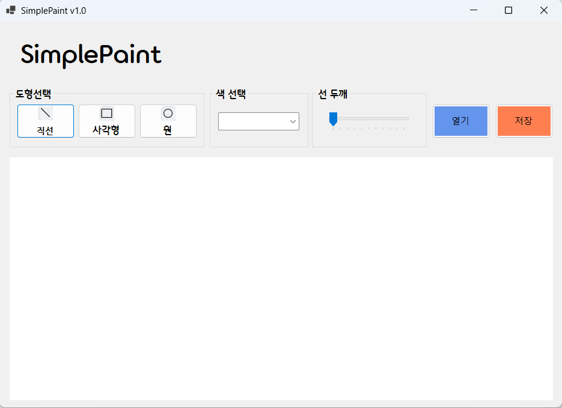

- 과제 내용
  - 그림판의 기본 UI 배치 및 도형선택, 색상선택, 선굵기선택 기능 구현
- 구현 내용과 기능 설명
  - 화면 중앙에 그림이 그려질 넓은 도화지(캔버스) 영역으로 PictureBox(picCanvas) 컨트롤을 배치했습니다.
  - 상단 메뉴 영역은 연관된 기능끼리 GroupBox를 활용하여 묶어서 가독성을 높였습니다.
  - 도형 선택 영역에는 Button 3개(btnLine, btnRectangle, btnCircle)를 배치하여, 직선/사각형/원 그리기 모드를 선택할 수 있도록 구현했습니다.
  - 색상 선택을 위해 ComboBox(cmbColor)를 배치하고 드롭다운 목록에서 검정, 빨강, 파랑, 녹색을 선택할 수 있게 했으며, 선 두께는 TrackBar(trbLineWidth)를 통해 최소 1부터 최대 10까지 조절할 수 있도록 설정했습니다.

## 실행 화면 (과제2)

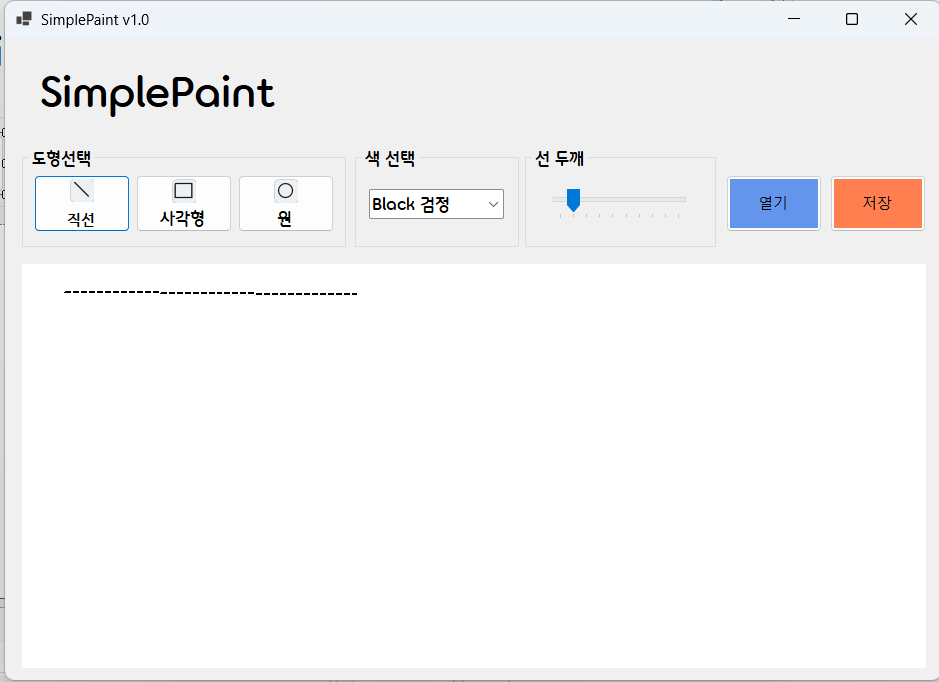

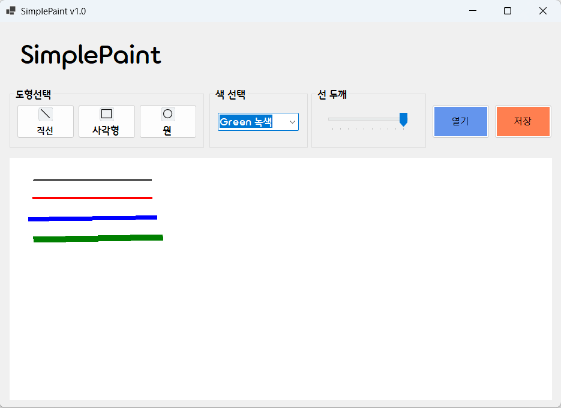

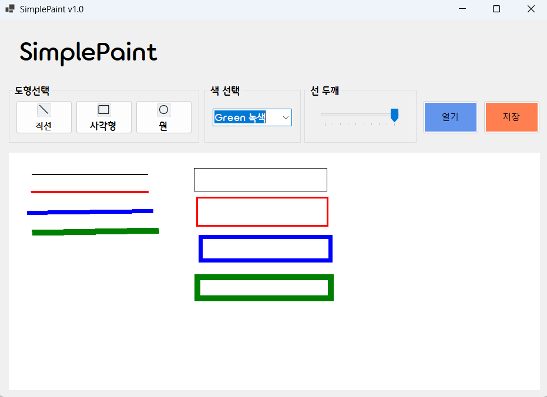

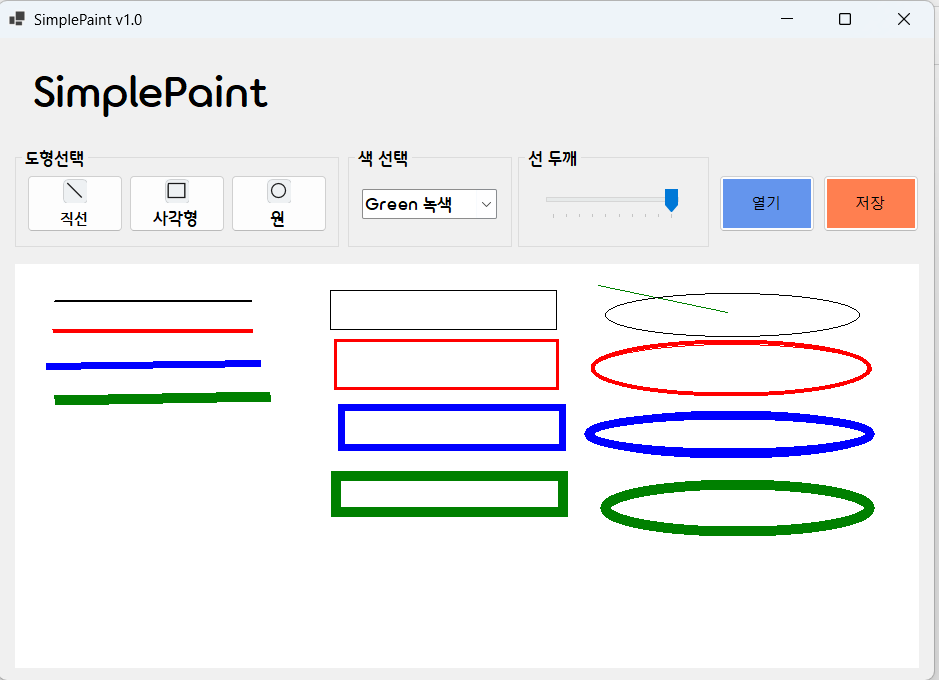

- 과제 내용
  - 마우스 드래그를 이용한 그림 그리기 기능 구현 (직선, 사각형, 원)
- 구현 내용과 기능 설명
  - PictureBox의 마우스 이벤트를 연동하여 드래그 기반의 그리기 기능을 구현했습니다. MouseDown 이벤트에서 드래그 시작점의 좌표를 저장하고 그리기 상태를 활성화합니다.
  - MouseMove 이벤트와 Paint 이벤트를 연동하여, 마우스를 드래그하는 동안 현재 선택된 도형이 점선(DashStyle.Dash) 형태로 캔버스에 미리 그려지도록 '미리보기' 기능을 구현했습니다.
  - MouseUp 이벤트가 발생하여 마우스를 뗄 때, Graphics 객체와 Pen(선택된 색상 및 굵기 적용)을 사용하여 실제 Bitmap 캔버스 메모리에 직선, 사각형, 원을 확정하여 그리도록 처리했습니다.
  - 사각형과 원의 경우 마우스를 드래그하는 방향(역방향 등)에 상관없이 정확한 위치와 크기를 계산할 수 있도록 Math.Min과 Math.Abs를 활용한 사각형 면적 계산 로직을 추가했습니다. 두께를 최소 1에서 최대 10까지 조절할 수 있도록 설정했습니다.

## 실행 화면 (과제3)

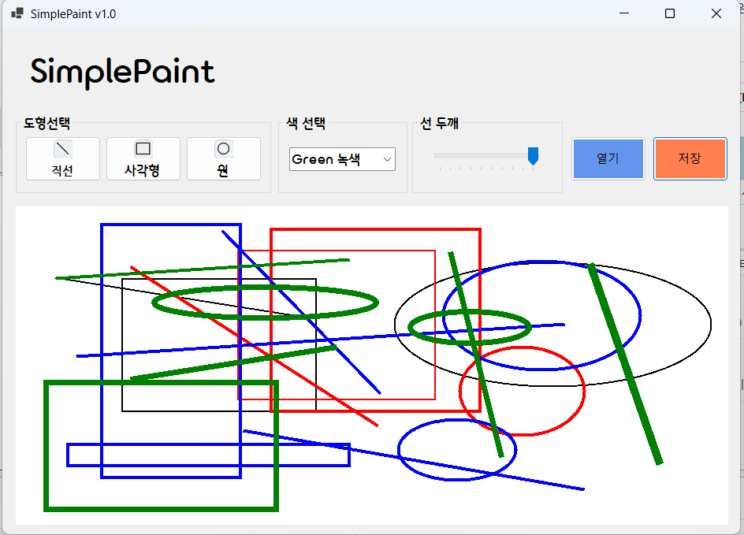

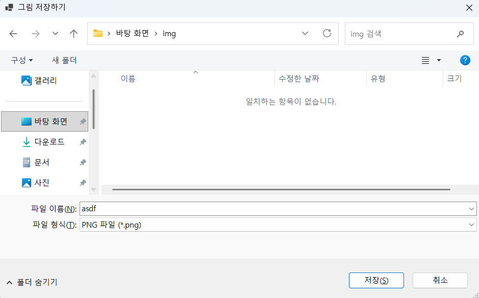

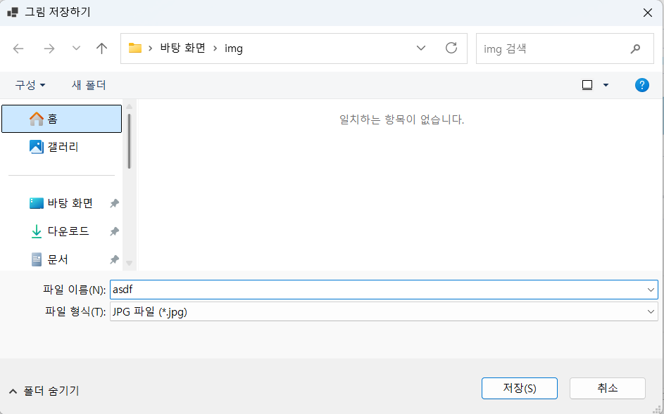

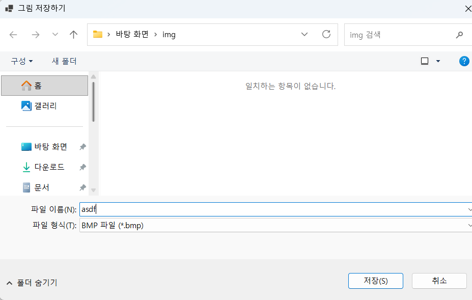

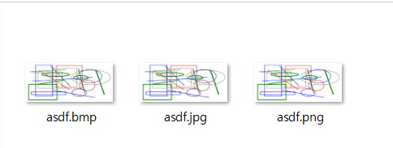

- 과제 내용
  - 그려진 그림을 이미지 파일로 저장하는 기능 구현
  - 파일 저장을 위한 대화상자인 SaveFileDialog 컴포넌트 사용
  - 작성된 이미지를 세 가지 포맷(.png, .jpg, .bmp)의 파일로 저장 지원
- 구현 내용과 기능 설명
  - 캔버스(PictureBox)에 마우스 드래그를 통해 그린 그림을 물리적 파일로 내보내기 위해, 버튼 클릭 시 `SaveFileDialog` 대화상자가 화면에 호출되도록 구현했습니다.
  - 대화상자 내에서 사용자가 원하는 형식을 선택할 수 있도록 필터(Filter) 속성을 설정하여 `.png`, `.jpg`, `.bmp` 세 가지 이미지 확장자 중 하나를 선택할 수 있게 만들었습니다.
  - 사용자가 파일명과 경로를 지정하고 저장 버튼을 누르면, 코드 내부에서 선택된 파일 확장자를 추출하고 캔버스로 사용 중인 `Bitmap` 객체의 `Save()` 메서드를 호출하여 해당 포맷에 맞춰 정확하게 저장되도록 로직을 완성했습니다.
  - 각기 다른 세 가지 포맷으로 정상적으로 저장 및 파일 생성이 이루어지는지 테스트를 완료했습니다.

## 실행 화면 (과제4)

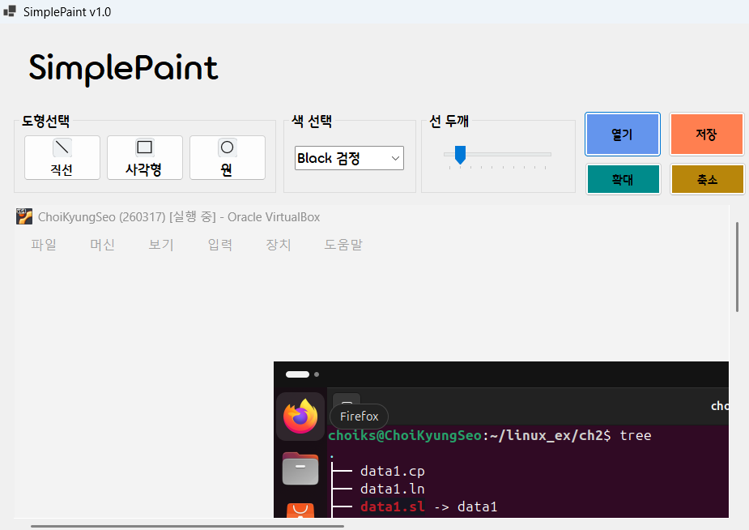

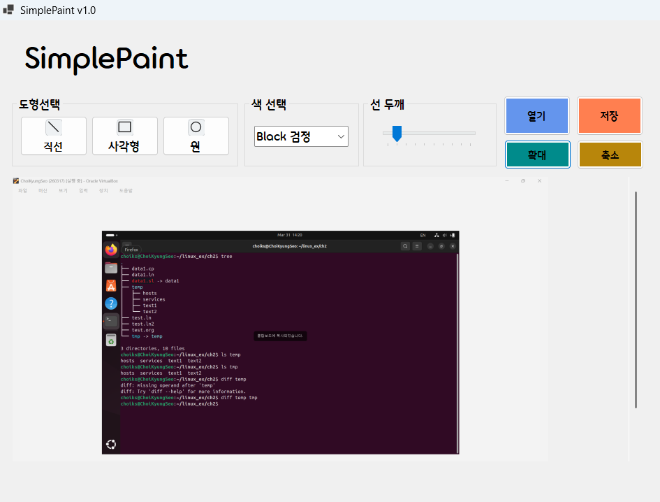

- 과제 내용
  - 외부 이미지 파일을 읽어 들여서 캔버스로 삼아 그 위에 그림을 그리고, 완성된 그림을 파일로 저장하는 기능 구현 [1].
  - 이미지 크기에 맞춰 캔버스 크기를 조정하고, 큰 이미지를 위한 스크롤바 생성 및 확대/축소 기능 추가 [1].

- 구현 내용과 기능 설명
  - OpenFileDialog 컴포넌트를 사용하여 사용자가 외부 이미지 파일을 찾아 불러올 수 있도록 대화상자 호출 기능을 구현했습니다. 선택된 이미지는 내부적으로 새로운 Bitmap 객체로 로드되어 기존 캔버스를 대체하게 됩니다.
  - 불러온 외부 이미지의 실제 크기에 맞추어 도화지 역할을 하는 PictureBox의 폭과 높이가 자동으로 조정되도록 코드를 작성했습니다. 이미지가 폼 화면보다 클 경우를 대비해, PictureBox를 Panel 컨트롤 안에 넣고 AutoScroll 속성을 활성화하여 스크롤바를 통해 이미지의 전체 영역을 탐색할 수 있도록 구성했습니다.
  - 상단 메뉴에 확대 및 축소 버튼을 배치하여, 사용자가 클릭할 때마다 지정된 비율(zoomFactor)만큼 PictureBox의 크기가 동적으로 변환되는 확대/축소 기능을 구현했습니다.
  - 화면이 확대되거나 축소된 상태에서도 엉뚱한 곳에 그림이 그려지지 않도록, 마우스 클릭 및 드래그 이벤트에서 가져온 화면 좌표를 현재의 확대/축소 비율로 나누어 실제 원본 Bitmap 이미지 기준의 좌표로 보정해 주는 수학적 연산 로직을 추가로 적용하여 정확도를 높였습니다.

